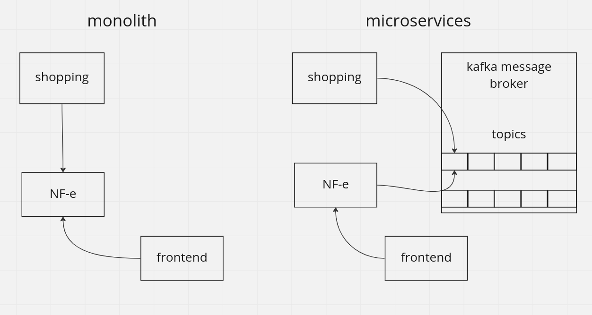

## A Brief Intro to Kafka

Kafka is a messaging system that safely moves data between systems. Depending on how each component is configured, it can act as a transport for real-time event tracking or as a replicated distributed database. Although it is commonly referred to as a queue, it is more accurate to say that it is something in between a queue and a database, with attributes and tradeoffs from both types of systems.

**Broker:** A single Kafka instance

**Topic:** Topics are used to organize data. You always read and write to and from a particular topic

**Producer:** A client that writes data to one or more Kafka topics

**Consumer:** A client that reads data from one or more Kafka topics



## Running example

Since Apache Kafka is a distributed streaming platform, it uses Zookeeper to store and manage the configuration information about Kafka topics, servers, producers, and consumers.


### 1. Start Kafka and Zookeeper:

With Docker:
```
docker-compose up
```

### or

Download and run local:
```
wget https://dlcdn.apache.org/kafka/3.3.1/kafka_2.13-3.3.1.tgz
```
Consult links bellow to start server:
  - https://kafka.apache.org/quickstart
  - https://phoenixnap.com/kb/install-apache-zookeeper


### 2. (optional) Create a topic:

```
sudo docker exec -it kafka /opt/bitnami/kafka/bin/kafka-topics.sh \
--create \
--bootstrap-server localhost:9092 \
--replication-factor 1 \
--partitions 1 \
--topic test
```

Topic is created in the Kafka container. Now we are gonna be able to use that topic from our producer such as our the producer.

### 3. Run producer 
 - **yarn start:producer** in kafka01/producer/

### 4. Run consumer
- **yarn start:consumer** in kafka01/consumer/

### 5. Send a **POST** requestion to **http://localhost:3000** with any body content, for example:
```
{
  "street": "Av. Colombo",
  "number": 23
}
```

##

Consult the links bellow to know more about the package **kafkajs**:
  - https://kafka.js.org/docs/introduction
  - https://kafka.js.org/docs/getting-started